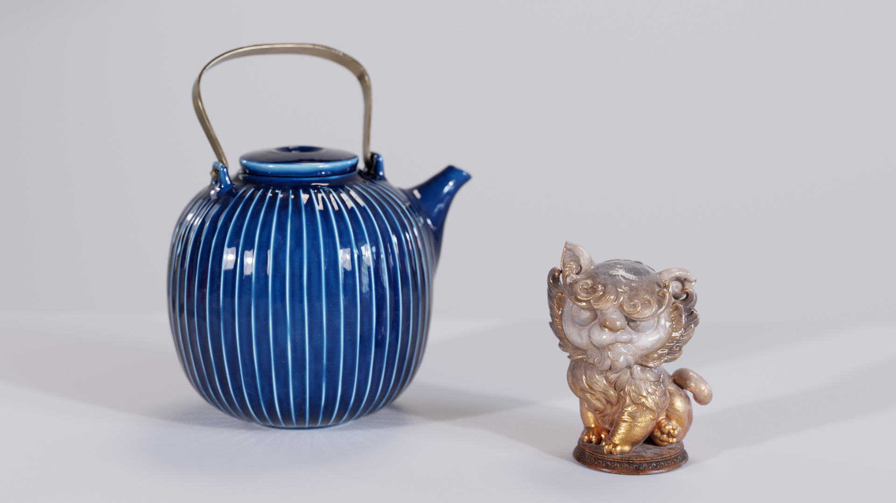

# MaterialX Teapot and MaterialX Lion Assets

This repository contains production-quality MaterialX assets from NVIDIA, contributed to the Digital Production Example Library (DPEL) for testing renderers, shading pipelines, and look-development tools. The MaterialX Teapot and MaterialX Lion use complex, multi-layered materials built entirely from the standard MaterialX node set—no proprietary extensions or dependencies required.

Originally created to showcase neural materials, the assets are provided here as portable MaterialX shader graphs. Standalone BSDFs are assembled with layer and mix nodes in a modular graph structure, combining individual texture inputs, normal maps, masks, and layer-specific controls.

## Technical Overview

- MaterialX 1.38 graphs authored in LookdevX
- Standard MaterialX nodes with no proprietary node dependencies
- One top-level USD file per asset, containing the material assignments
- Standalone BSDFs combined with layer and mix nodes
- Separate texture inputs, normal maps, masks, and controls for individual material layers
- 4K and 8K textures, including UDIM layouts
- Color textures use sRGB; normal, roughness, ORM, and mask textures are treated as non-color data

## Getting Started

Load either top-level USD file in a USD-compatible application:

- [`Teapot/teapot.usda`](Teapot/teapot.usda)
- [`Lion/lion.usda`](Lion/lion.usda)

The MaterialX source graphs are located in each asset's `Looks` directory, with textures organized by physical material layer.

## Asset Breakdown

| Asset | MaterialX files | Texture layout | Resolution |
| --- | ---: | --- | --- |
| MaterialX Teapot | 2 | Ceramic body: 14 UDIMs; handle: single texture | Ceramic: 4K; handle: 8K |
| MaterialX Lion | 1 | Lion body: 6 UDIMs | 4K |

Texture folders correspond to physical material layers such as albedo, normals, and masks.

## Publications and Presentations

The Teapot and Lion have appeared in the following research and course materials:

1. **SIGGRAPH 2024:** [*Neural Appearance Models*](https://research.nvidia.com/labs/rtr/neural_appearance_models/)
2. **SIGGRAPH 2025 Course — Physically Based Shading in Theory and Practice:** [*Bridging the Gap between Offline and Real Time with Neural Materials*](https://blog.selfshadow.com/publications/s2025-shading-course/weidlich/s2025_pbs_weidlich_slides.pdf)
3. **SIGGRAPH 2025 Course:** [*Neural Shading*](https://research.nvidia.com/labs/rtr/publication/duca2025neural/)
4. **SIGGRAPH 2025 Course:** [*Physically Based Shading in Theory and Practice*](https://blog.selfshadow.com/publications/s2025-shading-course/weidlich/s2025_pbs_weidlich_notes_v1.1.pdf)
5. **SIGGRAPH 2026 :** [*Taming optimization variance in compact neural shading networks*](https://github.com/NVlabs/neuralappearance/)

## Credits

- **MaterialX Teapot:** Davide Di Giannantonio Potente, Andrea Weidlich
- **MaterialX Lion:** Alex Liu, Zhelong Xu, Andrea Weidlich

## License

The assets are provided under the [ASWF Digital Assets License v1.1](LICENSE.md). See the license for permitted uses, attribution requirements, and the full disclaimer.

## Compatibility

The assets have been confirmed working in:

- Houdini 22 and earlier with Karma CPU
- Falcor 2
- MaterialX Playground
- OTOY Octane

Known limitations:

- **Houdini 22 and earlier with Karma XPU:** Arbitrary MaterialX nodes are not fully supported.
- **Hydra Storm:** UDIM textures are not supported. This also affects the Maya 2026 and 2027 viewports, which use Storm.
- **Hydra GL:** UDIM textures are not supported.
